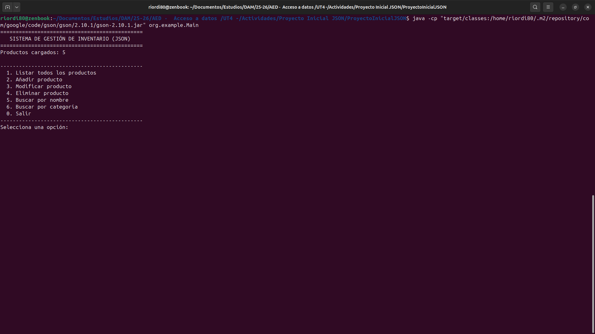
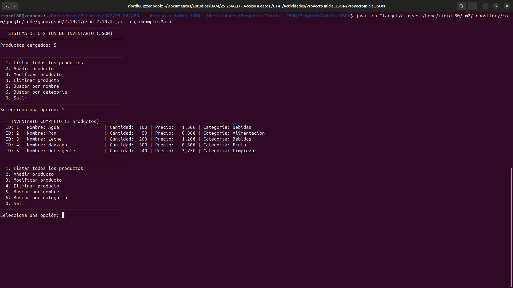
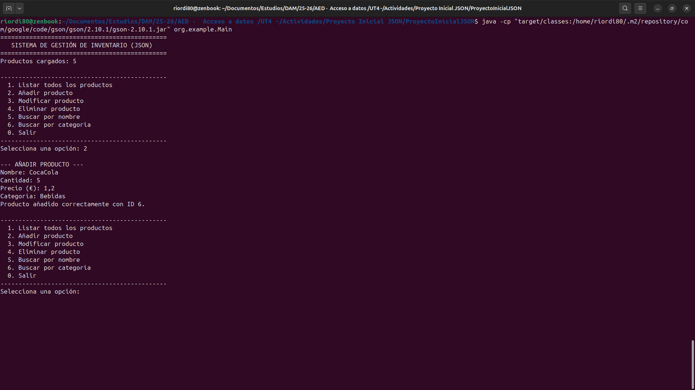
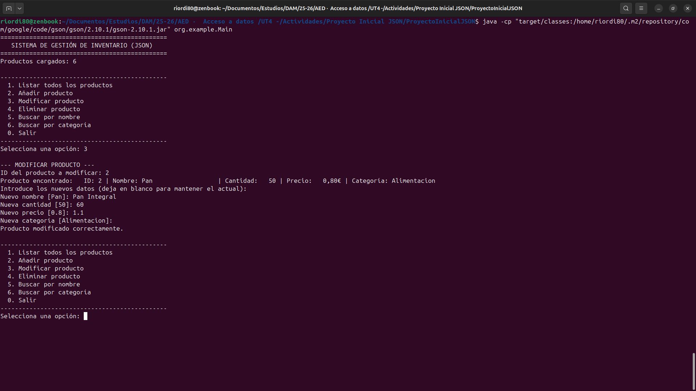
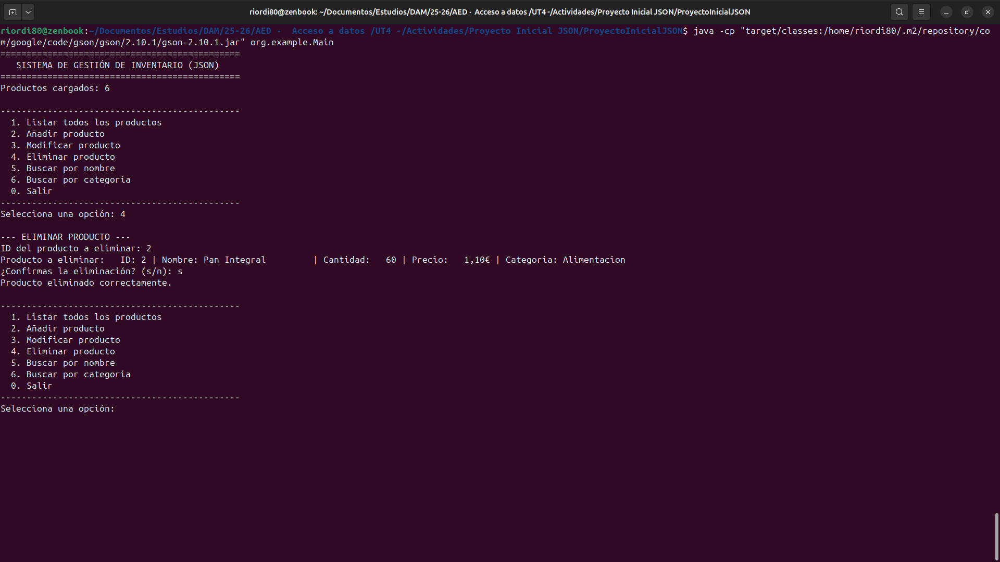
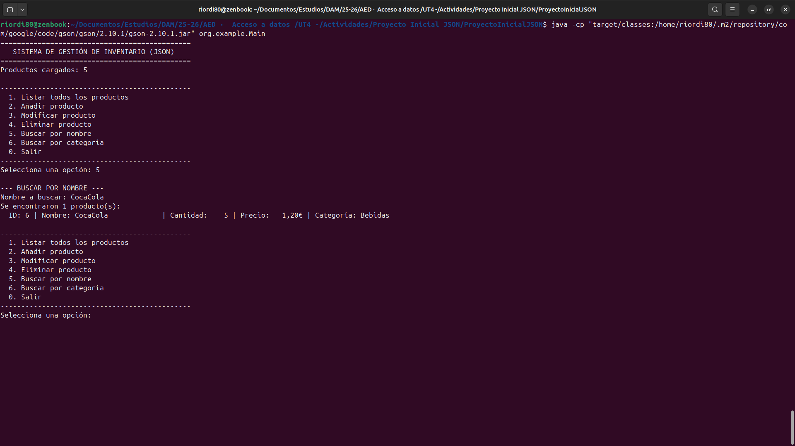
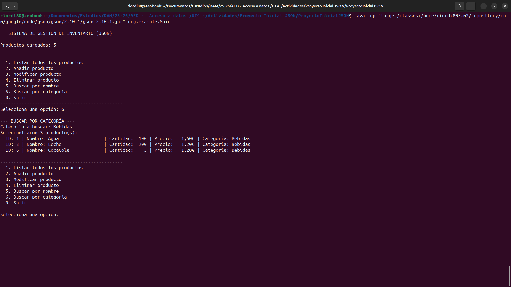
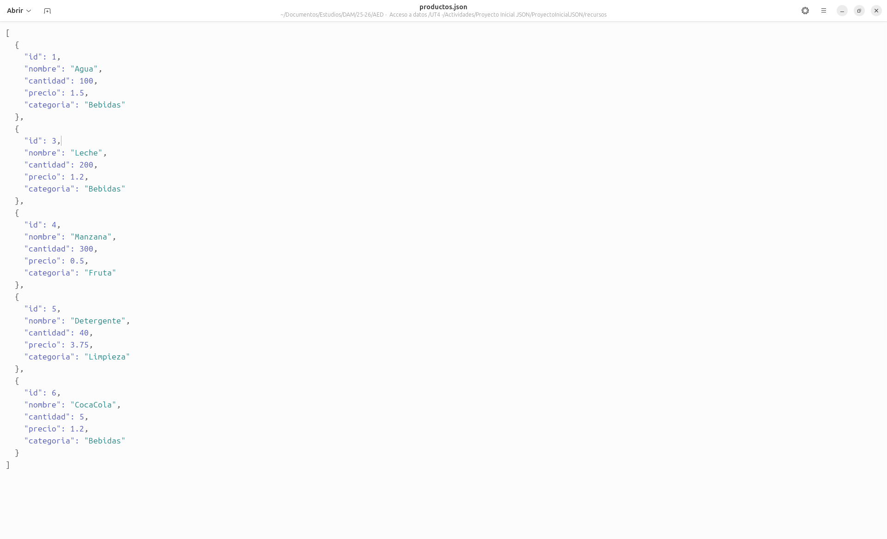
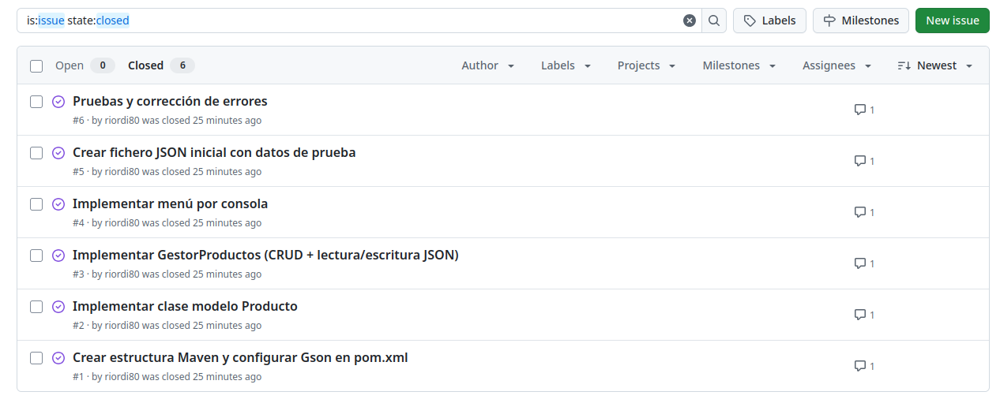
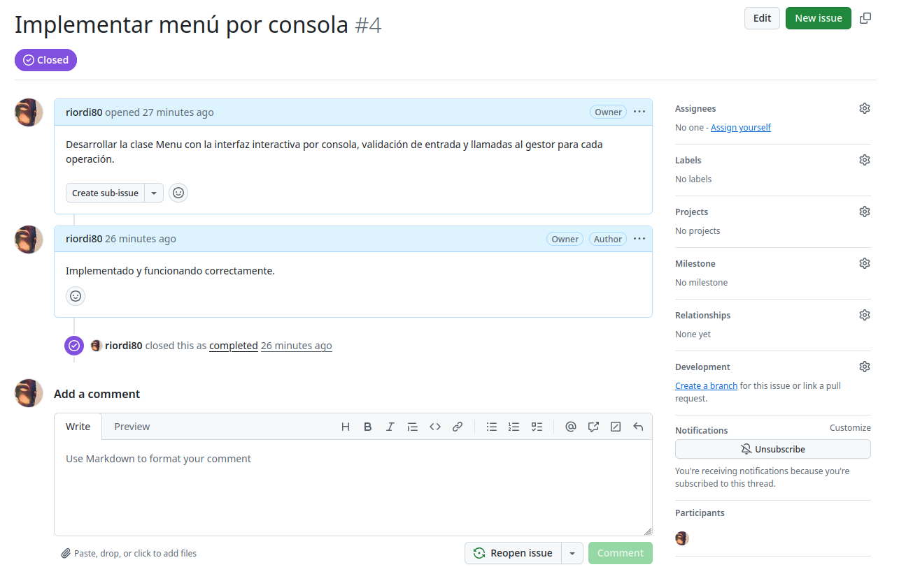

# Documentación - Proyecto Inicial JSON
## Gestión de Inventario con fichero JSON y Gson

**Asignatura:** Acceso a Datos  
**Unidad:** UT4 - Bases de datos documentales  
**Curso:** 2025/2026  

---

## 1. Descripción del proyecto

Aplicación Java por consola que gestiona un inventario de productos usando un fichero JSON como almacenamiento persistente. Utiliza la librería **Gson** para serializar y deserializar los objetos Java a/desde JSON.

Cada vez que el programa arranca, lee el fichero `recursos/productos.json`. Todas las operaciones (añadir, modificar, eliminar) actualizan el fichero inmediatamente, garantizando la persistencia entre ejecuciones.

---

## 2. Tecnologías utilizadas

- **Java 21**
- **Maven** (gestión de dependencias)
- **Gson 2.10.1** (serialización JSON)

---

## 3. Estructura del proyecto

```
ProyectoInicialJSON/
├── pom.xml
├── recursos/
│   └── productos.json          ← fichero de almacenamiento
└── src/main/java/org/example/
    ├── Main.java               ← punto de entrada
    ├── model/
    │   └── Producto.java       ← entidad de datos
    ├── controller/
    │   └── GestorProductos.java ← lógica CRUD + lectura/escritura JSON
    └── view/
        └── Menu.java           ← interfaz de consola
```

---

## 4. Estructura del JSON

Cada producto tiene los campos: `id`, `nombre`, `cantidad`, `precio` y `categoria`.

```json
[
  {
    "id": 1,
    "nombre": "Agua",
    "cantidad": 100,
    "precio": 1.5,
    "categoria": "Bebidas"
  }
]
```

---

## 5. Funcionamiento del programa

### 5.1 Carga inicial

Al iniciar, el programa lee el fichero JSON y muestra cuántos productos hay cargados.



---

### 5.2 Listar productos

Muestra todos los productos del inventario en formato tabla.



---

### 5.3 Añadir producto

Se solicitan los datos del nuevo producto y se añade al final del JSON.



**JSON antes:**
```json
[
  {"id": 1, "nombre": "Agua", "cantidad": 100, "precio": 1.5, "categoria": "Bebidas"},
  ...
]
```

**JSON después:**
```json
[
  ...,
  {
    "id": 6,
    "nombre": "CocaCola",
    "cantidad": 5,
    "precio": 1.2,
    "categoria": "Bebidas"
  }
]
```

---

### 5.4 Modificar producto

Se selecciona el producto por ID y se actualizan sus campos. Si se deja en blanco un campo, se mantiene el valor anterior.



**JSON antes:**
```json
{"id": 2, "nombre": "Pan", "cantidad": 50, "precio": 0.8, "categoria": "Alimentacion"}
```

**JSON después:**
```json
{"id": 2, "nombre": "Pan Integral", "cantidad": 60, "precio": 1.1, "categoria": "Alimentacion"}
```

---

### 5.5 Eliminar producto

Se selecciona el producto por ID, se muestra confirmación y se elimina del JSON.



**JSON antes:**
```json
[
  {"id": 1, "nombre": "Agua", ...},
  {"id": 2, "nombre": "Pan Integral", ...},
  {"id": 3, "nombre": "Leche", ...}
]
```

**JSON después:**
```json
[
  {"id": 1, "nombre": "Agua", ...},
  {"id": 3, "nombre": "Leche", ...}
]
```

---

### 5.6 Buscar producto

Hay dos tipos de búsqueda: por nombre (búsqueda parcial) y por categoría. El JSON no se modifica.





---

### 5.7 JSON final



---

## 6. Gestor de tareas (GitHub)

El proyecto se gestionó mediante **GitHub Issues** en el repositorio del proyecto.

**Repositorio:** `https://github.com/riordi80/gestion-inventario-json`

### Issues creadas:

| Issue | Título | Estado |
|-------|--------|--------|
| #1 | Crear estructura Maven y pom.xml con Gson | Cerrada |
| #2 | Implementar clase modelo Producto | Cerrada |
| #3 | Implementar GestorProductos (CRUD + JSON) | Cerrada |
| #4 | Implementar menú por consola | Cerrada |
| #5 | Crear fichero JSON inicial con datos de prueba | Cerrada |
| #6 | Pruebas y corrección de errores | Cerrada |




